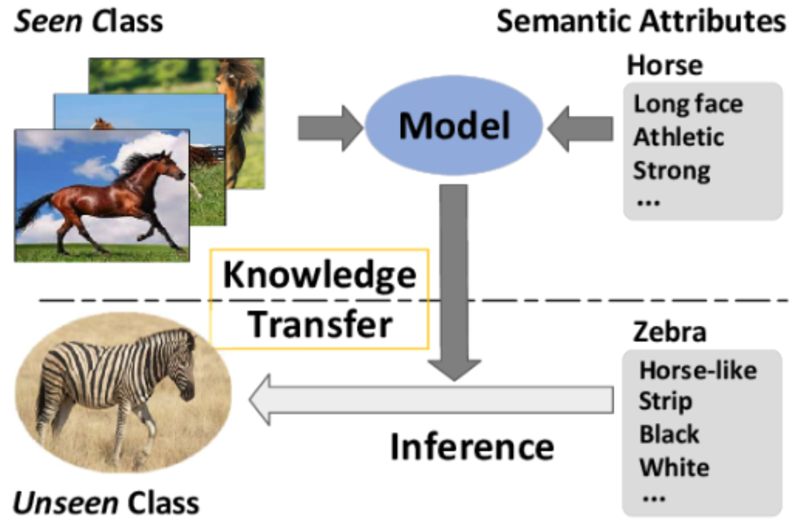
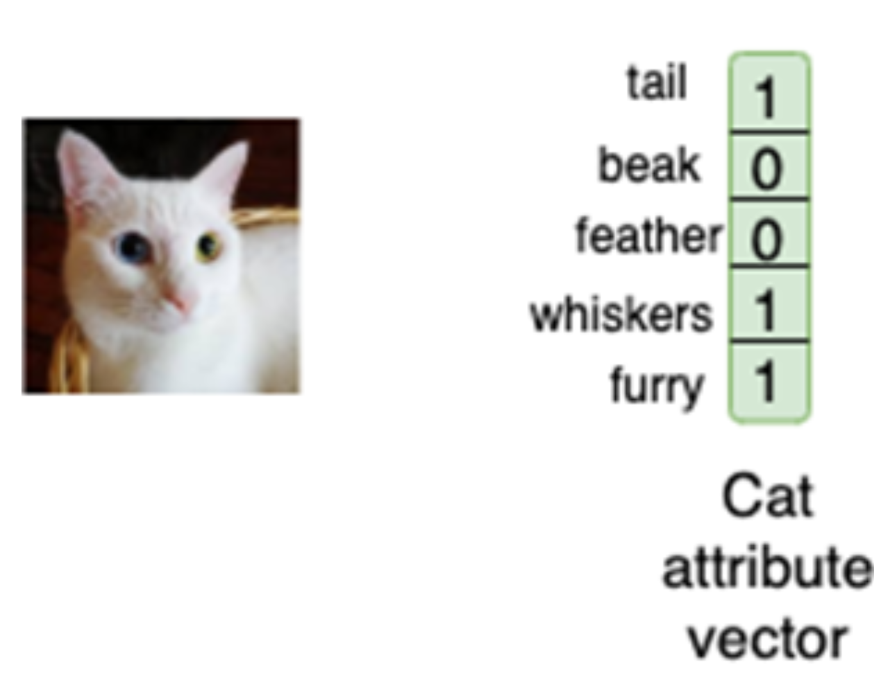
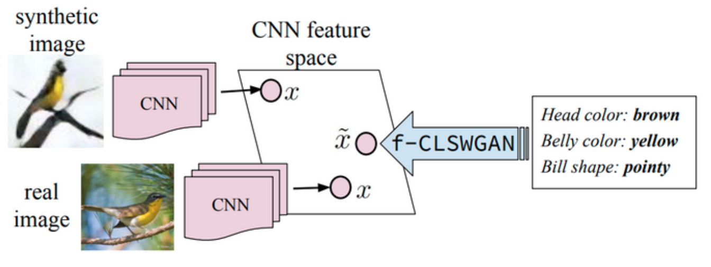
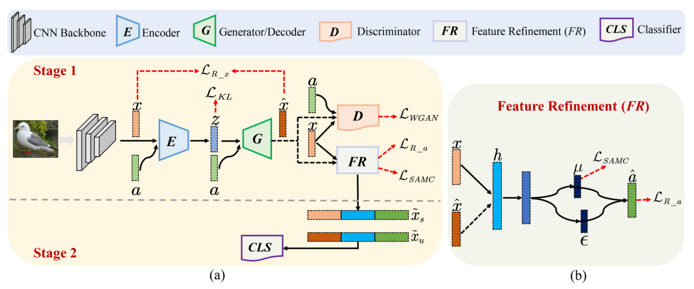
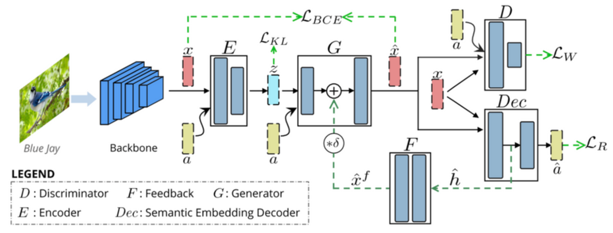
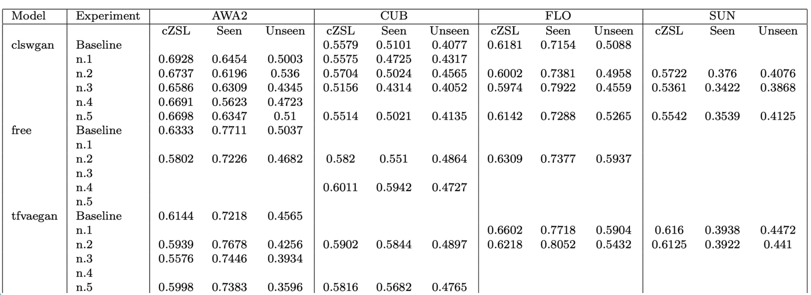
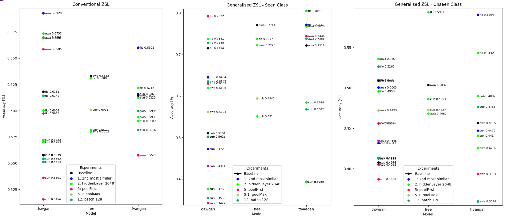
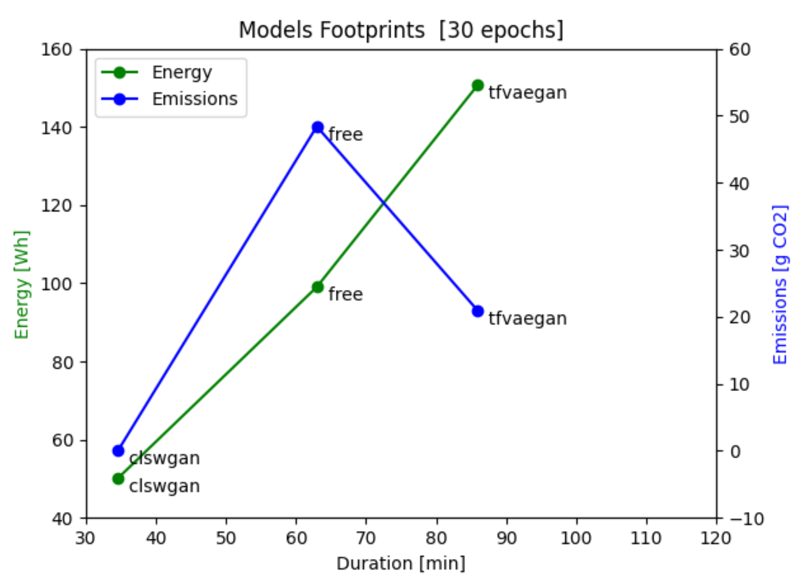

# Zero-Shot Learning
## Esame Computer Vision & Deep Learning - 2022/2023  

<i>Alesi Mattia  &nbsp; &nbsp; Proietti Marco</i>

---

Consiste nell’insegnare ad un modello CNN a riconoscere **classi mai viste durante l’addestramento** (a differenza delle classi viste).

#### Notazioni
- **Seen Classes:** classi per cui abbiamo immagini etichettate durante il training.
- **Unseen Classes:** classi per cui **non ci sono immagini etichettate nel training**.

#### Informazioni ausiliarie
- Descrizioni / attributi semantici / word embedding per entrambe le classi viste e non viste.
- Queste informazioni fanno da ponte tra le due tipologie di classi.
- Ogni classe è identificabile tramite il proprio **vettore di attributi**.

---

## Conventional ZSL
- Le immagini da riconoscere nel test appartengono solo a classi non viste.
- Poco utile nella pratica perché è difficile garantire che tutte le immagini al test vengano da classi non viste.

## Generalised ZSL
- Le immagini da riconoscere possono appartenere sia a classi viste che non viste.
- Più realistico e più complesso: il modello, addestrato solo sulle classi viste, tenderà a favorire queste ultime nelle predizioni.

---

## Attribute-based ZSL
- Mappatura semantica tra spazio degli attributi e classi, definita da un operatore umano.
- Le informazioni ausiliarie vengono salvate come **vettore one-hot** (es. `tail`, `beak`, `feather`, `whiskers`, `furry`).
- Ogni valore è `1` se l’attributo descrive quella classe, `0` altrimenti.

---

## Modelli

Tutti i modelli di stato dell’arte sono composti da:
1. Metodo generativo (es. GAN) condizionato da un vettore di attributi, per generare dataset sintetici delle classi non viste.
2. Classificatore allenato sul dataset completo (originale + sintetico).

Lo studio si è concentrato su:
- Architettura della rete di classificazione.
- Manipolazione degli attributi.

### CLSWGAN
  - Generative Adversarial Network che sintetizza feature CNN condizionate da informazioni semantiche di classe.

### FREE
  - Impiega un modulo **Feature Refinement** che integra mappatura semantica-visiva in un modello generativo unico.

### TFVAEGAN
  - Combina GAN e VAE.
  - Integra un **semantic embedding decoder** in tutte le fasi: training, sintesi delle feature, classificazione.

---

## Dataset

| Dataset | Seen Classes | Unseen Classes | Numero immagini | Tipologia |
|:-----------|:---------------|:----------------|:----------------|:------------|
| **CUB**    | 150             | 50               | 11'788            | Uccelli     |
| **AWA**    | 40              | 10               | 30'475            | Animali     |
| **FLO**    | 82              | 20               | 10'320            | Fiori       |
| **SUN**    | 645             | 72               | 14'340            | Scene       |

---

### Esperimenti

- **Riduzione dimensione hidden layer**
- **Aumento batch size**
- Test nuove opzioni di pooling:
  - `mean`
  - `max`
  - `first`

---

### Manipolazione degli attributi

- Esagerazione degli attributi della classe più simile (es. moltiplicandoli per una costante).
- Ricerca di attributi "salienti", cioè rari e distintivi rispetto ad altre classi simili.

---

### Scelte di Condizionamento

- Selezione delle classi su cui testare.
- Test prendendo solo la **seconda classe più simile**.

---

## Risultati
- Tabella dei risultati di accuratezza per ogni esperimento svolto.
- Confronto visuale dei risultati di accuratezza.

 

---

### Code Carbon 👉 [https://codecarbon.io/](https://codecarbon.io/)

Software lightweight per stimare la quantità di CO₂ prodotta dalle risorse di calcolo durante l’esecuzione del codice.  
Usato per misurare l’impatto ambientale di alcuni esperimenti.

---

## Sviluppi futuri

- Creazione di **combinazioni lineari di attributi** per migliorare il condizionamento.
- Ricerca di attributi salienti per ogni classe, per migliorare il riconoscimento di classi non viste.
- Applicazione di un **feedback vector** al modulo generativo.